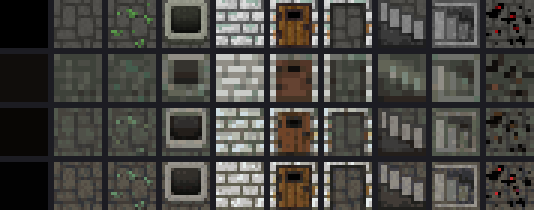
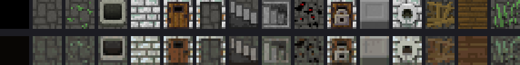
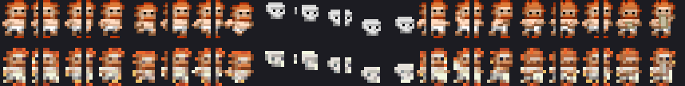
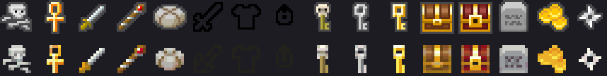

# Pixel Dungeon → 小米手环 Vela JS 快应用 贴图资源包

  -brightgreen)

> 在小米手环上跑像素地牢的"低精度贴图"全流程:像素源 → 自动批量降精度 → 紧凑图集 → 可直接在 Vela JS 快应用里 import 的 PNG + JS manifest。

**一句话**: 把 watabou/pixel-dungeon 的 82 张 16px 精灵表（465 KB / RGBA32 / 7042 色）批量转成手环能吃得下的 PNG-8 图集——推荐档 12px tile，**84 KB、压缩 5.5×、显存占用降 2.3×**。

**配套文本库**: 想让图旁边显示中文名/介绍/对话？用
[pixel-dungeon-text-zh](https://github.com/hefeishui0829/pixel-dungeon-text-zh)——
335 个类的中文文本（844 条，含物品/怪物/NPC 任务/五章剧情/死因），
每条都带 (图集名, tile 序号)，与本仓库 `sprites.json` 的 `coords[tile]` **直接对应，无需换算**。

### 30 秒速览

```bash
# 0) 看效果: 直接用浏览器打开 preview.html (手环 9 模拟屏 + 全部精灵表)
# 1) 重新生成贴图 (需要 pillow + numpy)
pip install pillow numpy
python3 tools/convert_sprites.py            # 生成 band + band-lite 两档

# 2) 直接拿现成的: output/band/ 下 82 张 PNG + sprites.js
# 3) 跑手环 demo: 用 AIoT-IDE 打开 demo/ 目录, manifest.json 已配 designWidth 192
```

---

## 1. 目标与背景

| 项目 | 内容 |
|---|---|
| **精灵来源** | watabou/pixel-dungeon v1.9.1 (commit `ca458a2`), 82 张 PNG 精灵表, 纯硬边像素画。**网格不是统一 16×16** —— 只有 8 张是, 其余 30 张各有网格 (`piranha` 12×16、`scorpio` 18×17、`rat` 16×15 …), 见 `tools/sprite_grid.json` |
| **开源协议** | GPL-3.0 (`src-assets/LICENSE-GPLv3.txt`)。任何分发须保留版权与协议副本 |
| **目标设备** | 小米 Vela JS 快应用 · 小米手环 9 / 10 (胶囊屏 192×490 / 212×520), 手环 8 Pro / 9 Pro (矩形屏 336×480) |
| **开发文档** | <https://iot.mi.com/vela/quickapp/zh/guide/multi-screens/> (屏幕规格); <https://iot.mi.com/vela/quickapp/zh/guide/multi-screens/specs.html> (designWidth 适配规范) |

### 为什么需要"更低精度"?

| 维度 | 原图 | 手环限制 |
|---|---|---|
| 屏幕 | 桌面 / 平板, 数千 px | 手环 9 仅 192 物理像素宽, 屏幕宽度 96dp |
| 包体 | 不敏感 | 单 rpk 通常 < 5MB, 单图解 < 512px 才不卡 |
| 色深 | RGBA32, 7042 种不透明色 | 32~64 色全局调色板即可覆盖视觉 |

---

## 2. 输出档位

实测数据（82 张 PNG 求和，非估算）：

| 档位 | tile 尺寸 | 调色板 | 磁盘总体积 | 压缩比 | 解码后 RGBA 显存 | 适用 |
|---|---|---|---|---|---|---|
| `band-lite` | 8px (原 1/2) | 24 色 / sheet | **46.8 KB** | **9.9×** | 527 KB (5.3×) | 手环 9 视野 24×61, 极限省体积 |
| **`band`** ★ | 12px (原 3/4) | 48 色 / sheet | **84.4 KB** | **5.5×** | 1181 KB (2.3×) | 手环 9 视野 16×40, 推荐档 |
| `band-pro` | 16px (原 1/1) | 64 色 / sheet | **97.6 KB** | **4.8×** | 1886 KB (1.5×) | 手环 8/9 Pro (336 宽) |
| (源素材) | 16px | RGBA32 (7042 色) | **465.4 KB** | — | 2770 KB | — |

**体积从哪省下来的**（对照实验：16px + 255 色，只做重打包/去重/空剔除，不降分辨率不减色 → 109.5 KB）：

```
465 KB  源素材
  ↓ -76%   ← 空 tile 剔除 + 内容帧去重 + 紧凑重打包 + PNG-8 索引化（这一项就占大头）
109 KB
  ↓ -11%   ← 调色板 255 → 64 色
 98 KB   = band-pro
  ↓ -14%   ← tile 16px → 12px（面积 -44%）
 84 KB   = band
  ↓ -45%   ← tile 12px → 8px（面积 -55%）
 46 KB   = band-lite
```

也就是说 **76% 的收益来自无损重打包**（原图集有大量全透明 tile 和重复动画帧），降分辨率 + 减色只是锦上添花。

★ `band` 12px 是默认推荐档: 192 物理像素屏上恰好 16 列 tile, 视野与原版 roguelike 接近, 同时把单张图集压在 2-3 KB 量级。

### 效果对比

> 每张图 **每档 tile 都放大到相同显示尺寸（48px/格，整数倍）**，方便横向比较画质损失。在手环上时每档按各自 tile 尺寸渲染。

**`tiles0` 地牢瓦片 + `warrior` 战士动画帧（4 档同图对比）**



单张图（原图 vs `band` 档 12px）：

**地牢瓦片 `tiles0`**（放大 6×）



**战士动画帧 `warrior`**（放大 4×）



**道具 `items`**（放大 5×）



---

## 3. 目录结构

```
pixel-dungeon-band/
├── README.md                 ← 你正在读
├── LICENSE                   ← GPL-3.0 (覆盖仓库内的像素地牢派生素材)
├── .gitignore
├── src-assets/
│   ├── orig/                 ← 原始像素地牢 82 张 PNG (664 KB)
│   ├── orig-app-icon/        ← 应用启动图标 ic_launcher 192x192 (来自 res/drawable-xxxhdpi/)
│   └── LICENSE-GPLv3.txt     ← 上游许可副本
├── tools/
│   ├── convert_sprites.py    ← 精灵表转换管线 (Python + Pillow + numpy)
│   └── convert_app_icon.py   ← 应用启动图标转换 (单张整图, 不做切片)
├── output/                   ← 转换产出, 每档一个独立目录 (已入库, 开箱即用)
│   ├── band/                 ★ 推荐档 12px  (82 PNG + 4 manifest + README)
│   │   ├── README.md         ← 该档详细说明 (参数/适用/用法)
│   │   ├── tiles0.png        ← PNG-8 索引色 + tRNS (透明)
│   │   ├── warrior.png
│   │   ├── ... (共 82 张)
│   │   ├── sprites.json      ← 总 manifest (37 KB)
│   │   ├── sprites.js        ← JS 模块, 直接 import
│   │   ├── palette.json
│   │   └── report.json       ← 该档统计
│   ├── band-lite/            8px 极限档   (含 README.md)
│   ├── band-pro/             16px 原分辨率档 (含 README.md)
│   └── app-icon/             应用启动图标 (icon.png 108px / icon@192.png)
├── demo/                     ← Vela JS 快应用 demo 工程
│   ├── manifest.json         ← designWidth: 192 (手环 9)
│   ├── src/
│   │   ├── app.ux
│   │   ├── i18n/{zh-CN,en-US}.json
│   │   ├── pages/index/index.ux   ← 主页: 14x14 地牢地图
│   │   ├── img/icon.png           ← 应用图标 (由 tools/convert_app_icon.py 生成)
│   │   └── common/                ← 由 tools/prepare_demo.sh 填 (已预填 band 档)
│   └── tools/prepare_demo.sh
├── docs/
│   ├── cmp_all_presets.png   ← 四档同图横向对比 (原图/pro/band/lite)
│   ├── cmp_tiles.png         ← 原图 vs band 档: 地牢瓦片
│   ├── cmp_warrior.png       ← 原图 vs band 档: 战士动画帧
│   └── cmp_items.png         ← 原图 vs band 档: 道具
└── preview.html              ← 浏览器预览页 (无需打包)
```

---

## 3.5 素材完整性核对

上游仓库 `watabou/pixel-dungeon` 的美术资产分布在两处，都已收录并转换：

| 上游位置 | 资产 | 状态 |
|---|---|---|
| `assets/*.png` | 82 张游戏内精灵表 | ✅ 已收录 `src-assets/orig/`，三档各输出 82 张，逐一比对**零缺失** |
| `res/drawable-*/ic_launcher.png` | 5 个 DPI 版本的应用启动图标（48/72/96/144/192） | ✅ 取 192 原图收录 `src-assets/orig-app-icon/`，已转 `output/app-icon/` |
| `assets/*.mp3` | 音效 | ❌ 非美术资产，不在本仓库范围 |

核对结果（脚本可复跑）：

```
源素材 82 张
  [band      ] 输出 82 张 | 缺失 0 | 多余 0   ✓
  [band-lite ] 输出 82 张 | 缺失 0 | 多余 0   ✓
  [band-pro  ] 输出 82 张 | 缺失 0 | 多余 0   ✓
三档中被整张判空丢弃的图集: 0
```

**空 tile 是正常现象，不是丢素材**。原图集留白很多（`surface` 128 格中 87 格空、`eye` 32 格中 20 格空），这些在 `coords` 里标 `null`、`tile()` 返回 `null`，渲染时跳过即可。

### 量化保真度（全库实测）

用每个图集自己的调色板还原源图不透明像素，算平均 RGB 欧氏距离（0 = 无损）：

| 档位 | 平均误差 | 最差图集 |
|---|---|---|
| `band-pro` 64 色 | **2.19** | items 20.6 |
| `band` 48 色 | **7.53** | ranger 25.2 |
| `band-lite` 24 色 | **16.45** | ghost 49.9 |

`buffs` / `large_buffs` / `badges` 这类图集色调高度分散（每个 buff 一种独立色相），均分色数时误差会飙到 30~55。管线里的 `COLOR_BONUS` 表给它们 1.5~2.5 倍颜色配额，误差降下来的代价只有 **+1.4 KB**。

### 应用启动图标

```bash
python3 tools/convert_app_icon.py
# → output/app-icon/icon.png     108x108  64 色  1.4 KB (7.0x)
# → output/app-icon/icon@192.png 192x192  64 色  2.3 KB (4.2x)
# → 同时拷到 demo/src/img/icon.png (manifest.json 的 icon 字段指向它)
```

> 手环快应用 `manifest.json` 的 `icon` 不强制固定尺寸，系统会自动缩放。108 版省体积，192 版保真，按需二选一。

---

## 4. 怎么用

### 4.1 重新生成贴图

```bash
# 默认生成 band + band-lite 两档
python3 tools/convert_sprites.py

# 只要 band-pro 档
python3 tools/convert_sprites.py --preset band-pro

# 一次生成全部三档 (推荐, 与仓库内 output/ 保持一致)
python3 tools/convert_sprites.py --preset band,band-lite,band-pro

# 自定义 (10px tile, 32 色全局调色板)
python3 tools/convert_sprites.py --preset custom --tile 10 --colors 32

# 输出 RGBA32 而非 PNG-8 (兼容性兜底)
python3 tools/convert_sprites.py --png-mode rgba

# 全库共享调色板 (体积更小但颜色会被占主导的图集拉偏)
python3 tools/convert_sprites.py --palette-scope global
```

每次运行会输出每张精灵表的"原 tile 数 / 去重后 / 空剔 / 原 KB / 新 KB / 压缩比"详细报告。

### 4.2 在浏览器里看效果

```
直接打开 preview.html
```

支持切换预设; 中央是手环 9 (192x490) 模拟屏, 渲染一个 14×14 的小地牢; 右侧是所有精灵表的缩略图。

### 4.3 喂给 Vela JS 快应用

```bash
# 把 band 档的 3 张关键精灵表 + sprites.js 拷进 demo 工程
bash demo/tools/prepare_demo.sh          # 默认 band
bash demo/tools/prepare_demo.sh band-lite # 想换档
```

然后在 AIoT-IDE 里打开 `demo/` 工程直接打包运行 (`designWidth: 192`, 屏自动适配)。
更多设备请把 manifest.json 的 `config.designWidth` 改为目标屏宽 (212 / 336)。

### 4.4 按原始序号取图（与中文文本库联动）

`output/<档位>/sprites.json` 里每张图集的 `coords` 数组，**下标 = 该图集在游戏内网格中的
帧序号**（行主序，从 0 开始；网格尺寸见每张图集的 `sourceTile`，来源是 `tools/sprite_grid.json`）。
全透明的格子记为 `null`，内容相同的格子指向同一坐标。
所以只要知道"它是第几格"，就能直接查到压缩图集上的位置：

> 注意：**不是**统一的 16×16 序号。游戏内 82 张精灵表里只有 8 张是标准 16×16，
> 其余使用各自的网格（`piranha` 12×16、`scorpio` 18×17、`rat` 16×15 …）。
> 早期版本错误地全部按 16×16 切，导致这些图集的动画帧整体错位，现已修正。

```js
import { SHEETS } from './sprites.js'
const xy = SHEETS.items.c[87]     // 第 87 格 -> [x, y]
```

配套仓库 [pixel-dungeon-text-zh](https://github.com/hefeishui0829/pixel-dungeon-text-zh)
已经把 173 个游戏对象（物品 / 怪物 / 植物 / 徽章）的中文名、中文介绍和原始 tile 序号整理好了，
两边用同一套寻址，可以直接拼出"图 + 中文说明"：

```bash
python3 ../pixel-dungeon-text-zh/tools/lookup_sprite.py --band . --id Amulet
# -> band-lite / band / band-pro 三档各自的 {image, x, y, tileWidth, tileHeight}
```

---

## 5. 转换管线原理 (`tools/convert_sprites.py`)

| 步骤 | 实现 |
|---|---|
| ① 切片 | 按每张图集**在游戏内的真实网格**切 (`tools/sprite_grid.json`, 由源码 `TextureFilm(W,H)` 反查得来) |
| ② alpha 预乘缩放 | `RGB *= A/255` → box 缩放 → `RGB = pre*255/A`, 避免透明黑边污染缩放结果 |
| ③ alpha 二值化 | 标准阈值 128; 若某格因此变全空但缩放前有内容, 退回低阈值 (32) 版本把它救回来 |
| ④ 调色板量化 | median-cut (默认按 sheet 独立量化, 防止木色/暖色"吃掉"全局调色板) |
| ⑤ 去空 + 内容去重 | 完全透明的 tile 不画; 内容相同的 tile 复用同一块图集区域 (同一角色多帧相同) |
| ⑥ 重打包 | 列数自适应 (`max-width / tile`), 紧凑排列, 输出 PNG-8 (索引色 + tRNS) |
| ⑦ manifest | 每张 sprite 的 `[x, y]` (空 tile 标记 `null`), `coords` 数组按索引一一对应, 体积小 (35 KB 全库) |

### 5.1 关键技术决策

* **box 缩放**: 像素画从 16→12 用最近邻会产生不均匀条纹, box 面积平均再 alpha 阈值化更干净
* **按 sheet 独立调色板**: 全局调色板被 banners 的暖色吃掉, 让灰色墙变棕色; 独立量化保真度大幅提升
* **PNG-8 而不是 PNG-32**: 索引色 + tRNS 二值透明, 体积缩 3~5 倍, 手环 PNG 解码器都支持
* **PLTE 只写实际颜色数**: 不写满 256 项, 小图集也能压缩
* **manifest 用数组而非对象**: 2000+ tile 的索引用 `["x", "y"]` 数组比对象字典小 4 倍

---

## 6. 开发参考

| 文档 | 链接 |
|---|---|
| Vela 快应用概述 | <https://iot.mi.com/vela/quickapp/zh/guide/> |
| 多屏适配 (屏幕规格表) | <https://iot.mi.com/vela/quickapp/zh/guide/multi-screens/> |
| 适配规范 (designWidth / px / dp) | <https://iot.mi.com/vela/quickapp/zh/guide/multi-screens/specs.html> |
| 项目结构 | <https://iot.mi.com/vela/quickapp/zh/guide/start/project-overview.html> |
| 组件总览 | <https://iot.mi.com/vela/quickapp/zh/components/> |
| 米坛社区 (Vela IDE / 教程) | <https://www.bandbbs.cn/> |

`designWidth` 推荐值:
* `192` — 手环 9 (96 dp 屏宽)
* `212` — 手环 10 (106 dp 屏宽)
* `336` — 手环 8/9 Pro (168 dp 屏宽)

---

## 7. 许可与署名

| 内容 | 许可 |
|---|---|
| `src-assets/orig/` 原始美术 | **GPL-3.0**, © watabou — 见仓库根 `LICENSE` |
| `output/` 转换后贴图 | **GPL-3.0**（派生物，许可不因降分辨率/减色而改变） |
| `tools/convert_sprites.py` 转换脚本 | **MIT** — 脚本本身不含 GPL 素材，可单独摘出用于任何项目 |
| `demo/` 快应用工程骨架 | **MIT** — 仅工程结构与示例页面，不含素材 |

根目录 `LICENSE` 为 GPL-3.0 全文（覆盖仓库内的像素地牢派生贴图），脚本内的 MIT 声明见各文件头部。

> **注意 GPL 传染性**: 若你的手环 rpk 是闭源/商用项目，不要把本仓库整个并进去。建议把 `output/<档位>/` 里实际用到的少量 PNG fork 成独立资源仓库，运行时通过资源包引入，避免 GPL 传染到宿主工程。

---

## 8. 常见问题

**Q: 为什么不用 8px，看着更小？**
8px 下人物五官会丢失、瓦片纹理糊成一团。除非手环内存真的非常紧张，否则 12px 是画质和体积的平衡点——想亲眼比较，改一行参数就行：`python3 tools/convert_sprites.py --preset band-lite` 然后打开 `preview.html` 切档。

**Q: 能不能只转我用得到的几张图集？**
可以。把 `src-assets/orig/` 里不需要的 PNG 删掉，或修改 `tools/convert_sprites.py` 的 `collect_tiles()` 扫目录逻辑加白名单，管线会自动只处理剩下的。

**Q: 支持手环 8 / 7 吗？**
老手环分辨率更低（如手环 7 为 192×490 但色深/性能更弱），`band-lite` 8px 档更合适；把 demo 的 `manifest.json` 里 `config.designWidth` 改成对应屏宽即可。

**Q: sprites.js 怎么用？**
```js
import { SHEETS, TILE, tile } from '../../common/sprites.js'
const s = SHEETS['tiles0']    // { image, iw, ih, tw, th, cols, c }
const p = tile('tiles0', 42)  // → { x, y, w, h } 或 null(该 tile 全透明/不存在)
TILE                          // → 12, 当前档位的 tile 边长
```

对应 CSS（`image` 组件或直接写样式）：

```css
.tile {
  background-image: url('/common/tiles0.png');
  background-position: -${p.x}px -${p.y}px;
  background-size: ${s.iw}px ${s.ih}px;   /* 图集原始尺寸, 必填 */
  width: ${s.tw}px; height: ${s.th}px;
}
```

`c` 数组按源图集的原生 tile 索引一一对应，所以**原版游戏里的 tile 编号可以直接沿用**，不需要重新映射。